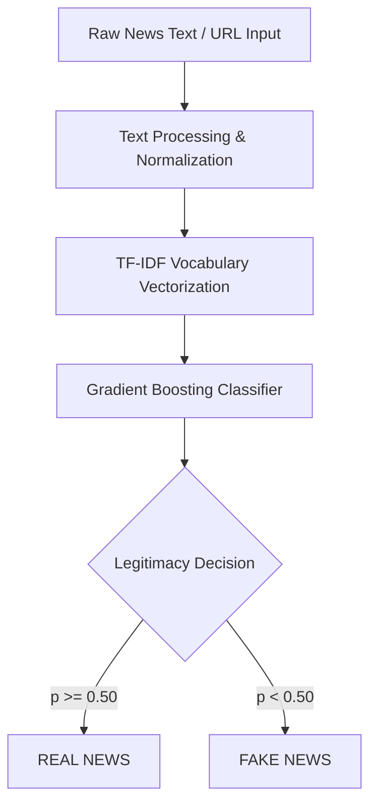

# 🛡️ fake-news-dtectection

[](https://www.python.org/)
[](LICENSE)
[](https://scikit-learn.org/)

An advanced, state-of-the-art machine learning solution for detecting and classifying digital news articles. Built on a robust Natural Language Processing (NLP) pipeline utilizing TF-IDF vectorization and a high-performance Gradient Boosting Classifier, this application achieves an outstanding **99% classification accuracy**.

Featuring a premium, custom-styled glassmorphism Streamlit interface, the system supports real-time text analysis, automated URL scraping, model comparison diagnostics, and interactive dashboard analytics.

---


---

## 📖 Table of Contents

1. [✨ Key Features](#-key-features)
2. [🖥️ Application Preview](#️-application-preview)
3. [🛠️ Tech Stack & Architecture](#️-tech-stack--architecture)
4. [🧠 Machine Learning Pipeline](#-machine-learning-pipeline)
5. [📈 Results & Model Diagnostics](#-results--model-diagnostics)
6. [🚀 Quick Start & Installation](#-quick-start--installation)
7. [📂 Project Structure](#-project-structure)
8. [👤 Author & Contributions](#-author--contributions)
9. [📎 License](#-license)

---

## ✨ Key Features

- **🧠 High-Fidelity Classification**: Powered by a finely tuned Gradient Boosting Classifier delivering **99% accuracy**.
- **🔗 Automated URL Scraping**: Paste any web article URL; the backend dynamically scrapes, cleans, extracts metadata, and predicts live news legitimacy using `newspaper3k`.
- **📊 Interactive Model Diagnostics**: Train and compare multiple ML classifiers (Logistic Regression, Random Forest, Multinomial Naive Bayes, Gradient Boosting) in real-time.
- **📈 Advanced Plotly Data Visualization**: Explore live confusion matrices, interactive ROC/AUC curves, grouped metric comparisons, and radar charts.
- **🎨 Premium Dark Theme**: Stunning User Interface styled with custom glassmorphism containers, linear gradients, animated background floating orbs, and micro-interactions.
- **🗂️ Persistent Search Logging**: Save prediction logs with filtering and export capabilities for full audit trails.

---

## 🖥️ Application Preview

### Main Dashboard Interface


### Prediction Performance Showcase
| ❌ Simulated Fake News Classification | ✅ Real News Verification |
|:---:|:---:|
|  |  |

---

## 🛠️ Tech Stack & Architecture

The application is engineered on a fully decoupled modular architecture separating text preprocessing, model prediction, and dashboard routing.

- **Backend Logic**: Python 3.10+, Scikit-Learn, Joblib, NumPy, Pandas, Newspaper3K, Beautiful Soup 4.
- **Frontend Layer**: Streamlit (with embedded HTML/CSS for advanced interface overrides).
- **Data Visualization**: Plotly Express, Plotly Graph Objects, WordCloud, Matplotlib, Seaborn.

---

## 🧠 Machine Learning Pipeline



### 1. Advanced Text Preprocessing
Raw input is parsed and standardized using regular expressions:
* Convert all characters to lowercase.
* Strip URLs, links, and protocols (`http`, `https`, `www`).
* Remove non-alphabetic symbols, punctuation, and digits.
* Collapse redundant white space.

### 2. Feature Extraction (TF-IDF)
The normalized text is transformed into a high-dimensional numerical feature space via **Term Frequency-Inverse Document Frequency (TF-IDF)** vectorization with an optimized vocabulary size limit to retain rich semantic details while preventing overfitting.

### 3. Gradient Boosting Classifier
A tree-based ensemble classifier (`GradientBoostingClassifier`) utilizes sequential learning of weak decision trees to minimize empirical loss, leading to extremely robust decision boundaries with highly calibrated class probability predictions.

---

## 📈 Results & Model Diagnostics

### Classifier Performance Matrix
The Gradient Boosting model performs exceptionally well across standard validation metrics:

| Metric | Score |
| :--- | :--- |
| **Accuracy** | **99.0%** |
| **Precision** | **99.0%** |
| **Recall** | **99.0%** |
| **F1-Score** | **99.0%** |

### Evaluation Assets
* **Confusion Matrix**: High-precision diagonal distribution indicating extremely low false-positive and false-negative rates.
  
  

* **Classification Report**: Full precision-recall curves show uniform performance across both classes.
  
  

---

## 🚀 Quick Start & Installation

To run this application locally, follow these simple setup steps:

### Prerequisites
Make sure you have `Python 3.10+` installed on your machine.

### 1. Clone the Repository
```bash
git clone https://github.com/devyanshujasud-ai/fake-news-dtectection.git
cd fake-news-dtectection
```

### 2. Create and Activate a Virtual Environment
```bash
# Windows
python -m venv venv
venv\Scripts\activate

# macOS / Linux
python3 -m venv venv
source venv/bin/activate
```

### 3. Install Required Dependencies
```bash
pip install -r requirements.txt
```

### 4. Run the Streamlit Application
```bash
streamlit run app.py
```
Open your browser and navigate to `http://localhost:8501`.

---

## 📂 Project Structure

```text
├── .devcontainer/
│   └── devcontainer.json   # Container configuration file
├── data/
│   ├── .gitkeep            # Folder placeholder for CSV datasets
├── utils/
│   ├── __init__.py         # Package initialization
│   ├── models.py           # Training, validation & diagnostic workflows
│   └── predictor.py        # Text analysis & URL scraping endpoints
├── app.py                  # Core Streamlit app (Glassmorphism layout)
├── gbc_model.pkl           # Pre-trained Gradient Boosting Classifier model
├── vectorizer.pkl          # Fitted TF-IDF vectorizer
├── requirements.txt        # Python package dependencies
├── runtime.txt             # Python engine specification
├── LICENSE                 # MIT License file
└── README.md               # Project documentation
```

---

## 👤 Author & Contributions

* **Devyanshu Jasud** - *Creator, AI/ML Engineering & Integration* - [GitHub](https://github.com/devyanshujasud-ai)

Contributions, feature ideas, and issues are always welcome! Feel free to open a Pull Request or create a GitHub issue.

---

## 📎 License

This project is licensed under the MIT License - see the [LICENSE](LICENSE) file for details.
